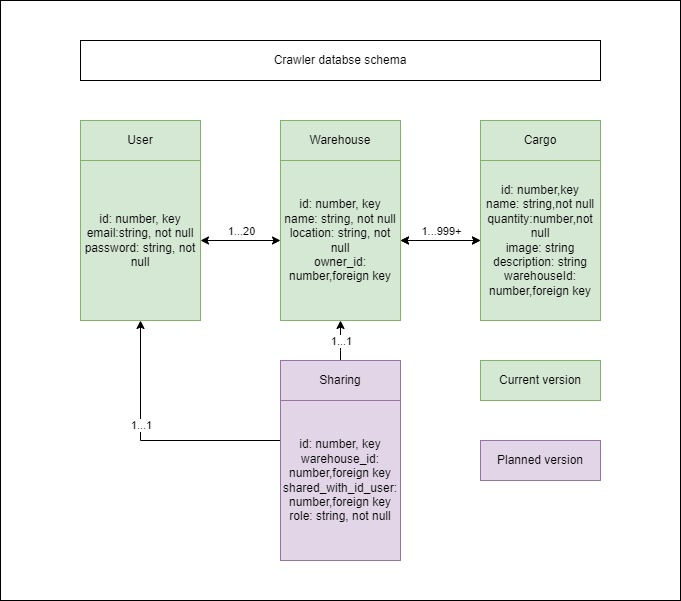

# Technical Design

## Project Architecture
```
src/
|__assets/
|   |__images/
|       |__background-image.jpg
|__hoc/
|   |__AuthChecker.jsx // Checking if user may join route
|
|__redux-store/
|   |__basic-table/
|   |   |__BasicTableSlice.js // Table select store
|   |__modal/
|   |   |__ModalSlice.js // Modal store
|   |__index.js
|
|__router
|   |__AppRouter.jsx
|   |__Routers.js // Routes settings
|
|__services
|   |__AuthService.js
|   |__CargoService.js
|   |__WarehouseService.js
|
|__ui
|   |
|   |__compoments/
|   |   |__button/
|   |   |   |__Button.jsx
|   |   |   |__Button.scss
|   |   |__<Element>/
|   |   |   |__<Element>.jsx
|   |   |   |__<Element>.scss
|   |   |__...
|   |
|   |__pages/
|   |   |__confirm-removing/
|   |   |   |__ConfirmRemoving.dictionary.js
|   |   |   |__ConfirmRemoving.jsx
|   |   |   |__ConfirmRemoving.scss
|   |   |   |__ConfirmRemoving.test.js
|   |   |__<Page>/
|   |   |   |__<Page>.dictionary.js
|   |   |   |__<Page>.jsx
|   |   |   |__<Page>.scss
|   |   |   |__<Page>.test.js
|   |   |__...
|   |
|   |__styles/
|   |   |__Breakpoints.scss
|   |   |__Colors.jsx
|   |   |__Panes.scss
|   |   |__Text.jsx
|   |   |__...
|
|__utils/
|   |__Constants.js
|   |__LocalStorageUtil.js
|   |__Panes.scss
|   |__Text.jsx
|   |__...

App.js
App.scss
index.js
index.scss
reportWebVitals.js
setupTests.js
```

---


## Feature list

### [BE] Connect application with MySQL
- Set up back end application with MySQL database
### [BE] Create migration scripts for database filling
- Create functionality for creating\filling\cleading database with scripts running.

<details>
<summary>Spoiler (databse schema image).</summary>
<pre>


</pre>

</details>

### [BE] Create application API routes
- Create API routes and their interaction with database. 
    [[Postman link]](https://documenter.getpostman.com/view/24378540/2s8YzP2k8f)
---
### [FE] Add ESLINT into project
- Add ESLing and Prettier to the project.
    - Configuration - Airbnb;
    - Other rules: 
        - "react/jsx-props-no-spreading": "off",
        - "react/prop-types": "off",
### [FE] Create routing functional
- Create functionality for allowing\disallowing user to join route. 

    Route settings entity looks like { path: LINK, needAuth: false, element: \<COMPONENT \/>, exact: true }, where:
    - LINK is route path;
    - COMPONENT - react page component to render on this route;
    - needAuth - auth state to join this page(true - must be logged in, false - must be unlogged, null - any stage may join this route).

### [FE] Create Header and Footer components
- Creating header component template. It should be represented by two states(logout and logged in), rendered on any page and contain:
    - App logo;
    - Link to main page;
    - Link to home page(disabled on logout stage);
    - Link to sign in page(on logout stage);
    - Link to sign up page(on logout stage);
    - Username (on logged in stage);
    - Dropdown menu on username click (on logged in stage) with:
        - Link to settings page;
        - Logout option.

### [FE] Create Main page
- Creating "Main page" with introduction information about application:
    - Route - ```/```;
    - Access: any stage;
    - Containts: 
        - App introdution;
        - Link to Home (on logged in stage);
        - Link to Sign up (on logout stage);
        - Link to Help page.

### [FE] Create help page
- Creating "Help page" with usefill information about application:
    - Route - ```/help```;
    - Access: any stage;
    - Containts: 
        - Several blocks with nessesary information:
            - Title;
            - Text.

### [FE] Create Error page
- Creating "Error page" for displaying on unexist routes:
    - Route - ```/any_unexist_route```;
    - Access: any stage;
    - Containts: 
        - Several blocks with nessesary information:
            - Title;
            - Text.

### [FE] Create pages and logic for login functionality
- Creating "Sign in page" for allowing user to log in into the system:
    - Route - ```/sign in```;
    - Access: logout stage;
    - Containts: 
        - Form title;
        - Input for email;
        - Input for password;
        - Errors displaying;
        - Button for Sign in;
        - Button for redirect to Forgot password page.
- Creating "Sign up page" for allowing user to sign up in the system:
    - Route - ```/sign up```;
    - Access: logout stage;
    - Containts: 
        - Form title;
        - Input for email;
        - Input for password;
        - Input for password confirm;
        - Errors displaying;
        - Button for Sign up;
        - Button for redirect to Forgot password page;
- Creating "Forgot password page" for allowing user to reset password:
    - Route - ```/forgot-password```;
    - Access: logout stage;
    - Containts: 
        - Form title;
        - Input for email;
        - Errors displaying;
        - Button for Reset password.

### [FE] Create Home page
- Creating "Home page" for displaying all warehouses which are available to the user:
    - Route - ```/home```;
    - Access: logged in stage;
    - Containts: 
        - Link to add warehouse page;
        - Input for search by name;
        - Warehouses table with:
            - Warehouse name;
            - Warehouse id;
        - Warehouses in use by user counter.

### [FE] Create create warehouse page
- Creating "Create warehouse page" for adding new warehouse entity into the system:
    - Route - ```/create-warehouse```;
    - Access: logged in stage;
    - Containts: 
        - Form title;
        - Input for warehouse name;
        - Input for warehouse location;
        - Input for collaborators;
        - Errors displaying;
        - Button for Create warehouse;
        - Button for redirect to Home page.

### [FE] Create update warehouse page
- Creating "Create warehouse page" for updating exist warehouse entity in the system:
    - Route - ```/update-warehouse/:warehouseId```;
    - Access: logged in stage;
    - Containts: 
        - Form title;
        - Input for warehouse name;
        - Input for warehouse location;
        - Input for collaborators;
        - Errors displaying;
        - Button for Update warehouse;
        - Button for redirect to Warehouse page with warehouseId.

### [FE] Create Warehouse page
- Creating "Warehouse page" for managing warehouse entities:
    - Route - ```/warehouse/:warehouseId```;
    - Access: logged in stage;
    - Containts: 
        - Warehouse name;
        - Warehouse location;
        - Warehouse entity records;
        - Displayed elements on page filter;
        - Input for search entity by name;
        - Entities table with:
            - Entity id;
            - Entity name;
            - Entity quantity;
            - Entity select option;
        - Pagination for changing table pages;
        - Errors displaying;
        - Button for Delete selected entities(redirect to Confirm removing page);
        - Button for Delete warehouse(with conformation by id modal);
        - Button for redirect to Add cargo page;
        - Button for redirect to Warehouse update page.

### [FE] Create create entity page
- Creating "Create Entity page" for creating entity record:
    - Route - ```/warehouse/:warehouseId/create-entity```;
    - Access: logged in stage;
    - Containts: 
        - Set entity name element (in modal);
        - Warehouse location;
        - Set entity notes element (in modal);
        - Set entity image element (in modal);
        - Set entity quantity element (with counter);
        - Button for Create entity;
        - Button for redirect to Warehouse page with warehouseId.

### [FE] Create Entity page
- Creating "Entity page" for seeing entity detail information and updating entity information:
    - Route - ```/warehouse/:warehouseId/entity/:entityId```;
    - Access: logged in stage;
    - Containts: 
        - Display\Update entity name element (in modal);
        - Warehouse location;
        - Display\Update entity notes element (in modal);
        - Display\Update entity image element (in modal);
        - Display\Update entity quantity element (with counter);
        - Button for Delete entity;
        - Button for Update entity;
        - Button for redirect to Warehouse page with warehouseId.

### [FE] Create Confirm removing page
- Creating "Confirm removing page" for multiple entity delete confirmation:
    - Route - ```/warehouse/:warehouseId/confirm-removing```;
    - Access: logged in stage;
    - Containts: 
        - Warehouse name element (in modal);
        - Input for search by name;
        - Delete prompt text;
        - Entities to delete table with:
            - Entity id;
            - Entity name;
            - Entity quantity;
            - Entity select option;
        - Button for Update entity;
        - Button for Delete entity;
        - Button for Confirm delete entity;
        - Button for redirect to Warehouse page with warehouseId.

### [FE] Create settings page
- Creating "Settings page" for allowing user make actions with its own account:
    - Route - ```/settings```;
    - Access: logout stage;
    - Containts: 
        - Form title;
        - Block for password update:
            - Input for old password;
            - Input for new password;
            - Input for confirm new password;
        - Errors displaying;
        - Button for Update settings;
        - Button for redirect to Home page.